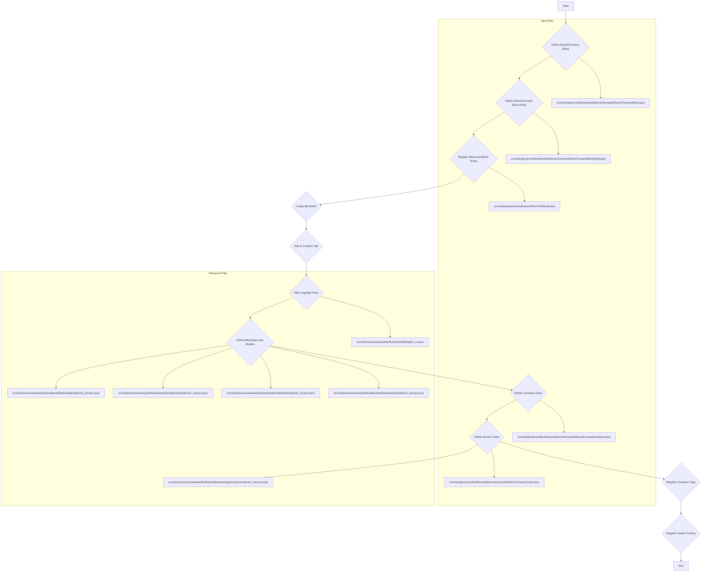

# ElectricFurnace Block Implementation Plan

This document outlines the plan for adding the ElectricFurnace block to the FluxTheWorld Minecraft mod. The ElectricFurnace will be a block with an associated Block Entity, capable of smelting items using vanilla furnace recipes. It will not have a crafting recipe initially. It will also include a custom GUI for player interaction.

## Overview Diagram



## Detailed Steps

1.  **Create `ElectricFurnaceBlock.java`**
    *   **Path**: `src/main/java/com/fluxtheworld/electricfurnace/ElectricFurnaceBlock.java`
    *   **Description**: This class will define the properties and behavior of the ElectricFurnace block itself.
    *   **Key Implementations**:
        *   Extend `net.minecraft.world.level.block.Block`.
        *   Define basic block properties (e.g., material, strength, resistance) using `BlockBehaviour.Properties`.
        *   Override methods for block entity interaction, such as `newBlockEntity()` to create an instance of `ElectricFurnaceBlockEntity` when the block is placed, and `getRenderShape()` if a custom rendering shape is needed.
        *   Override `use()` method to open the GUI when the player right-clicks the block.

2.  **Create `ElectricFurnaceBlockEntity.java`**
    *   **Path**: `src/main/java/com/fluxtheworld/electricfurnace/ElectricFurnaceBlockEntity.java`
    *   **Description**: This class will manage the ElectricFurnace's internal logic, such as inventory, smelting process, and data persistence.
    *   **Key Implementations**:
        *   Extend `net.minecraft.world.level.block.entity.AbstractFurnaceBlockEntity` or implement `net.minecraft.world.Container` and `net.minecraft.world.WorldlyContainer`. Extending `AbstractFurnaceBlockEntity` is preferred for leveraging vanilla furnace logic.
        *   Handle inventory management (input, fuel, output slots).
        *   Implement smelting logic, likely by overriding `canBurn()` and `burn()` methods from `AbstractFurnaceBlockEntity` to utilize vanilla furnace recipes.
        *   Implement methods for saving and loading the block entity's data (`saveAdditional()`, `load()`).
        *   Implement `MenuProvider` to provide the `ElectricFurnaceContainer` to the client.

3.  **Create `ElectricFurnaceContainer.java`**
    *   **Path**: `src/main/java/com/fluxtheworld/electricfurnace/ElectricFurnaceContainer.java`
    *   **Description**: This class defines the server-side inventory management for the ElectricFurnace GUI. It handles the slots and how items move between the player's inventory and the furnace.
    *   **Key Implementations**:
        *   Extend `net.minecraft.world.inventory.AbstractContainerMenu`.
        *   Define the slots for input, fuel, and output.
        *   Implement `stillValid()` and `quickMoveStack()` for proper inventory interaction.

4.  **Create `ElectricFurnaceScreen.java`**
    *   **Path**: `src/main/java/com/fluxtheworld/electricfurnace/ElectricFurnaceScreen.java`
    *   **Description**: This class handles the client-side rendering of the ElectricFurnace GUI.
    *   **Key Implementations**:
        *   Extend `net.minecraft.client.gui.screens.inventory.AbstractContainerScreen`.
        *   Draw the background texture, progress bar, and other GUI elements.
        *   Handle mouse and keyboard input.

5.  **Modify `FluxTheWorld.java`**
    *   **Path**: `src/main/java/com/fluxtheworld/FluxTheWorld.java`
    *   **Description**: This is the main mod class where blocks, items, block entities, and container types are registered.
    *   **Key Modifications**:
        *   **Block Registration**: Add a `public static final DeferredBlock<Block> ELECTRIC_FURNACE_BLOCK` and register it using `BLOCKS.registerSimpleBlock("electric_furnace", ...)` or `BLOCKS.register("electric_furnace", () -> new ElectricFurnaceBlock(...))`.
        *   **Block Entity Type Registration**: Create a new `public static final DeferredRegister<BlockEntityType<?>> BLOCK_ENTITY_TYPES` and register the `ElectricFurnaceBlockEntity` type.
        *   **BlockItem Registration**: Add a `public static final DeferredItem<BlockItem> ELECTRIC_FURNACE_BLOCK_ITEM` and register it using `ITEMS.registerSimpleBlockItem("electric_furnace", ELECTRIC_FURNACE_BLOCK)`.
        *   **Container Type Registration**: Create a new `public static final DeferredRegister<MenuType<?>> MENU_TYPES` and register the `ElectricFurnaceContainer` type.
        *   **Creative Tab Integration**: In the `addCreative` method, add `event.accept(ELECTRIC_FURNACE_BLOCK_ITEM)` to the desired creative tab (e.g., `CreativeModeTabs.BUILDING_BLOCKS`).

6.  **Modify `FluxTheWorldClient.java` (or a new client-side setup class)**
    *   **Path**: `src/main/java/com/fluxtheworld/FluxTheWorldClient.java` (or create a new class like `ClientSetup.java`)
    *   **Description**: This class handles client-side registrations, such as linking container types to their respective GUI screens.
    *   **Key Modifications**:
        *   Register the `ElectricFurnaceScreen` factory using `MenuScreens.register()`. This links the `ElectricFurnaceContainer` to the `ElectricFurnaceScreen`.

7.  **Modify `en_us.json`**
    *   **Path**: `src/main/resources/assets/fluxtheworld/lang/en_us.json`
    *   **Description**: This file contains the English translations for in-game elements.
    *   **Key Modification**:
        *   Add a new entry: `"block.fluxtheworld.electric_furnace": "Electric Furnace"`.
        *   Add a new entry for the GUI title: `"container.electric_furnace": "Electric Furnace"`.

8.  **Create Blockstate and Model JSONs**
    *   **`src/main/resources/assets/fluxtheworld/blockstates/electric_furnace.json`**
        *   **Description**: Defines the visual states of the block in the world (e.g., default, active).
        *   **Content Example**:
            ```json
            {
              "variants": {
                "": { "model": "fluxtheworld:block/electric_furnace" }
              }
            }
            ```
    *   **`src/main/resources/assets/fluxtheworld/models/block/electric_furnace.json`**
        *   **Description**: Defines the 3D model for the block when placed in the world.
        *   **Content Example**:
            ```json
            {
              "parent": "block/cube_all",
              "textures": {
                "all": "fluxtheworld:block/electric_furnace"
              }
            }
            ```
    *   **`src/main/resources/assets/fluxtheworld/models/item/electric_furnace.json`**
        *   **Description**: Defines the model for the block when it is in item form (e.g., in inventory or held).
        *   **Content Example**:
            ```json
            {
              "parent": "fluxtheworld:block/electric_furnace"
            }
            ```
    *   **`src/main/resources/assets/fluxtheworld/textures/block/electric_furnace.png`**
        *   **Description**: This will be the texture file for the ElectricFurnace block. A placeholder will be used initially.
    *   **`src/main/resources/assets/fluxtheworld/textures/gui/container/electric_furnace.png`**
        *   **Description**: This will be the texture file for the ElectricFurnace GUI background. A placeholder will be used initially.

This revised plan provides a clear roadmap for implementing the ElectricFurnace block, including its GUI, with a feature-based package structure.